# Active Directory Home Lab: Windows Server Domain Controller

## Overview

This project documents a local Active Directory home lab built with Oracle VirtualBox and Windows Server 2022. The lab creates a Windows Server virtual machine named `DC01`, configures it with a static IP address, promotes it to a Domain Controller, configures DNS, creates Organizational Units, creates users and security groups, assigns group membership, and applies a basic domain password policy.

The goal of this lab is to practice foundational Windows Server and Active Directory administration in a safe local environment.

## Lab Objectives

This lab demonstrates how to:

- Create a Windows Server 2022 virtual machine in VirtualBox
- Configure bridged networking for LAN connectivity
- Assign a static IP address and DNS settings
- Install the Active Directory Domain Services role
- Promote a server to a Domain Controller
- Create a new Active Directory forest and domain
- Configure a DNS forwarder
- Create Organizational Units
- Create user accounts and security groups
- Assign users to groups
- Configure a basic password policy with Group Policy
- Verify users and group membership with PowerShell

## Lab Environment

| Component | Value |
|---|---|
| Hypervisor | Oracle VirtualBox |
| Server OS | Windows Server 2022 Standard Evaluation |
| VM Name | DC01 |
| Domain | lab.local |
| Domain Controller | DC01 |
| Example Static IP | 192.168.86.10 |
| Network Mode | Bridged Adapter |
| DNS | DC01 points to itself for DNS |
| DNS Forwarder | Router/Gateway IP |

> Your IP values may be different depending on your home network. Use your own gateway, subnet, and available static IP address.

## Requirements

See [`REQUIREMENTS.md`](REQUIREMENTS.md) for the full hardware, software, and network requirements.

## Project Structure

```text
active-directory-homelab-virtualbox/
├── README.md
├── REQUIREMENTS.md
└── screenshots/
    ├── 01-vm-created-with-server-iso.png
    ├── 02-bridged-network-adapter.png
    ├── 03-server-renamed-dc01.png
    ├── 04-static-ip-and-dns-settings.png
    ├── 05-ipconfig-all-verification.png
    ├── 06-active-directory-domain-services-role.png
    ├── 07-domain-admin-login.png
    ├── 08-dns-forwarder-configured.png
    ├── 09-nslookup-dns-verification.png
    ├── 10-organizational-units-created.png
    ├── 11-security-groups-created.png
    ├── 12-user-accounts-created.png
    ├── 13-hr-team-membership.png
    ├── 14-it-helpdesk-membership.png
    ├── 15-password-policy-configured.png
    └── 16-powershell-ad-verification.png
```

## Step 1: Create the Windows Server VM

A new VirtualBox virtual machine was created and named `DC01`. The Windows Server 2022 ISO was attached during VM creation, with 4 GB of memory, 2 CPUs, and a 50 GB virtual hard disk.

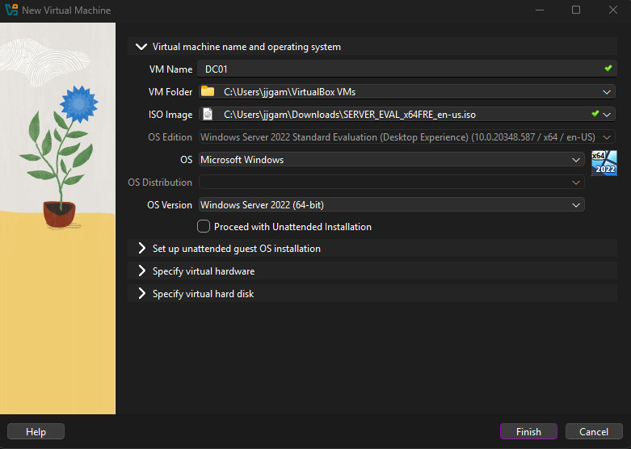

## Step 2: Configure Bridged Networking

The VM network adapter was changed to **Bridged Adapter** so the server could sit directly on the same LAN as the host machine. This is important for Active Directory labs because domain clients must be able to communicate with the Domain Controller.

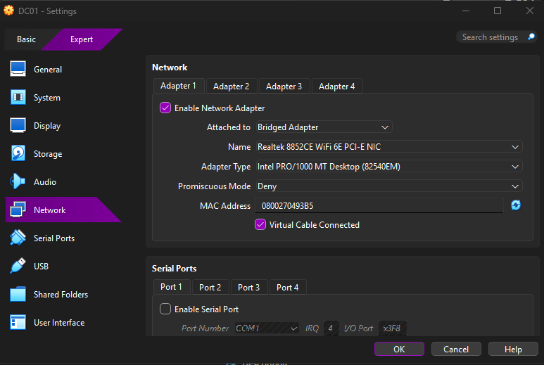

## Step 3: Rename the Server to DC01

After Windows Server was installed, the server was renamed to `DC01`. A clear server name makes the Domain Controller easy to identify in Server Manager, DNS, and Active Directory tools.

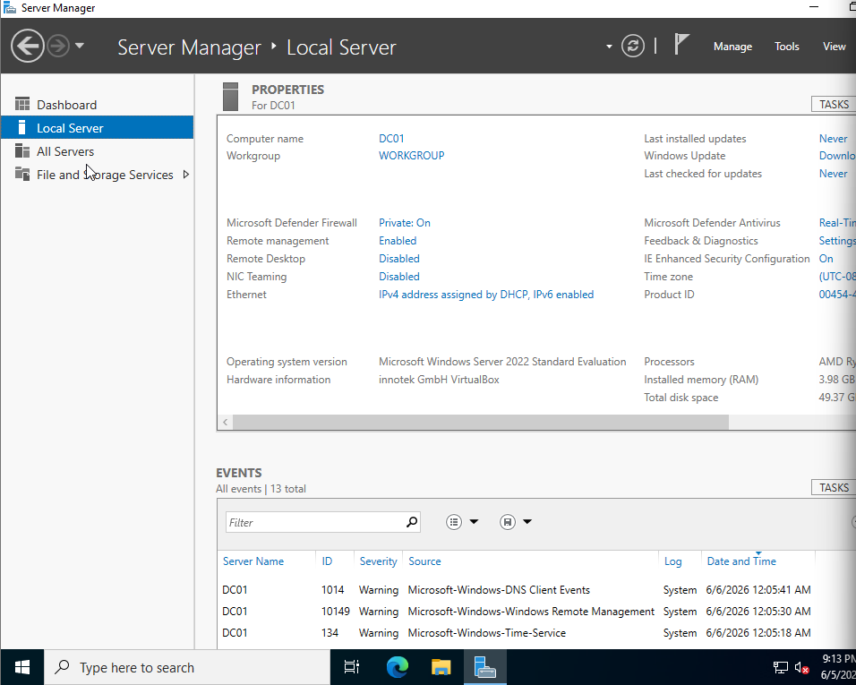

## Step 4: Configure Static IP and DNS

The server was assigned a static IPv4 address. The preferred DNS server was set to the Domain Controller's own IP address.

This is critical because Active Directory depends heavily on DNS. A Domain Controller should use itself for DNS, not the router.

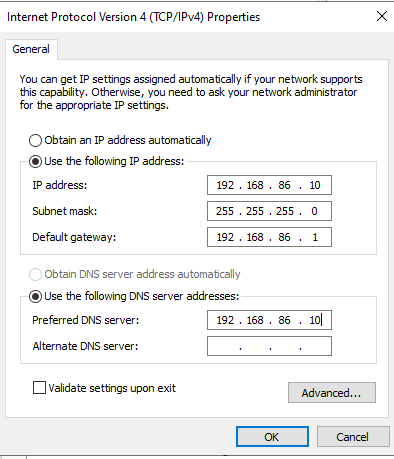

The configuration was then verified with `ipconfig /all`.

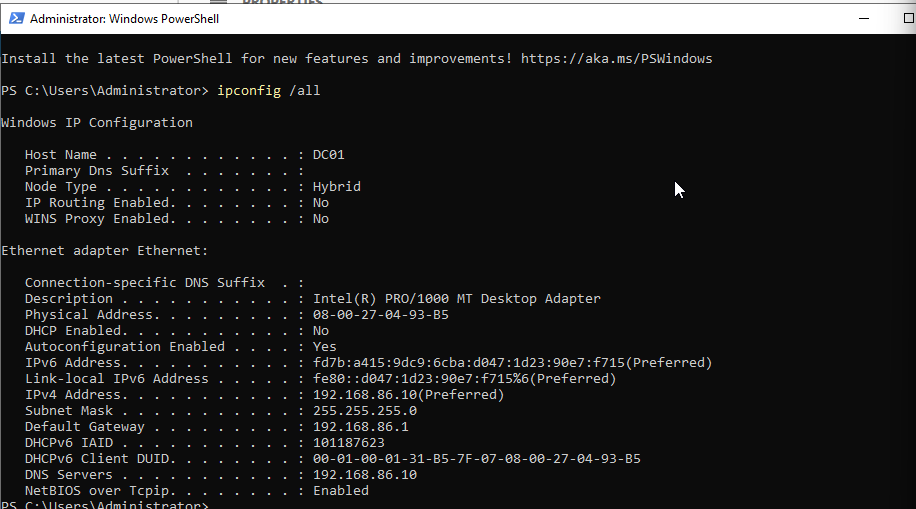

## Step 5: Install Active Directory Domain Services

The **Active Directory Domain Services** role was installed through Server Manager.

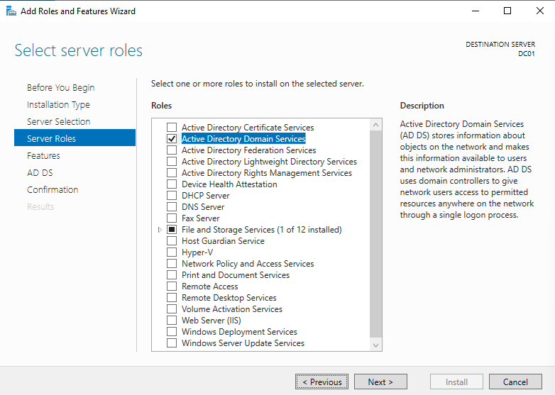

## Step 6: Promote the Server to a Domain Controller

After installing the AD DS role, the server was promoted to a Domain Controller for a new forest named `lab.local`.

After the promotion and reboot, the login screen showed the domain administrator format.

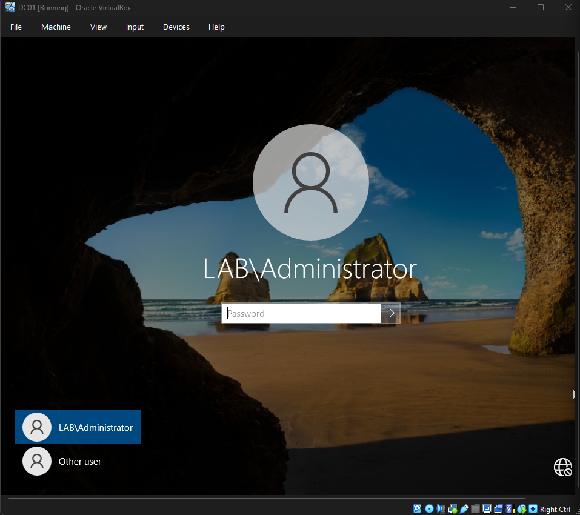

## Step 7: Configure DNS Forwarder

A DNS forwarder was configured so the Domain Controller could resolve external names by forwarding requests to the router/gateway.

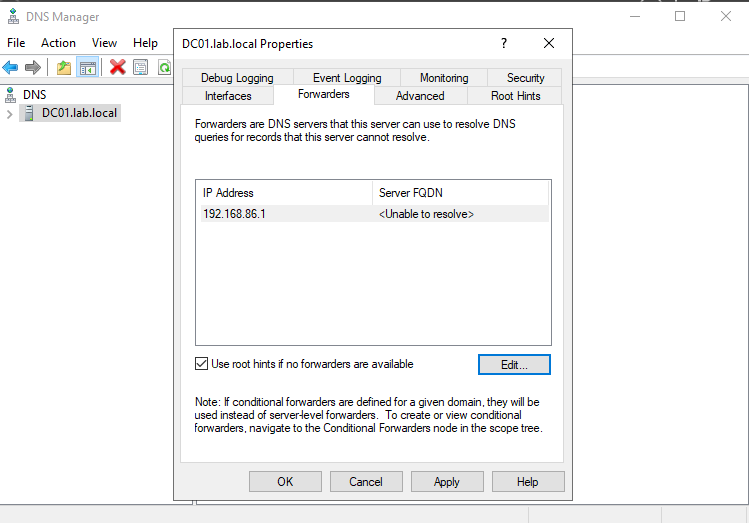

DNS resolution was verified using `nslookup`.

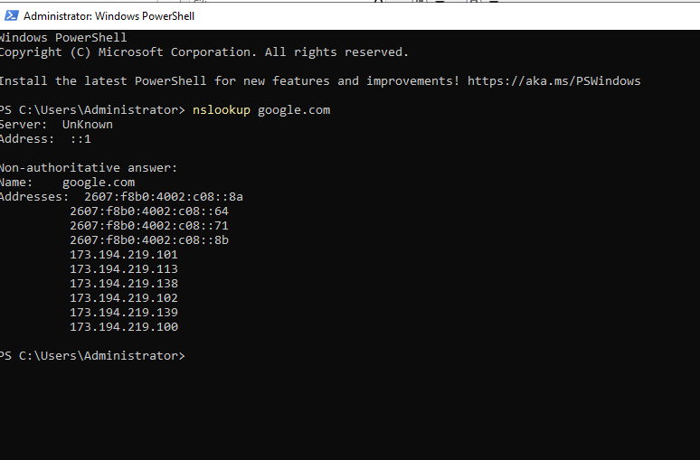

## Step 8: Create Organizational Units

Two custom Organizational Units were created:

- `Users Account`
- `Groups`

Custom OUs make the directory easier to manage and allow policies to be targeted more cleanly than using only the default containers.

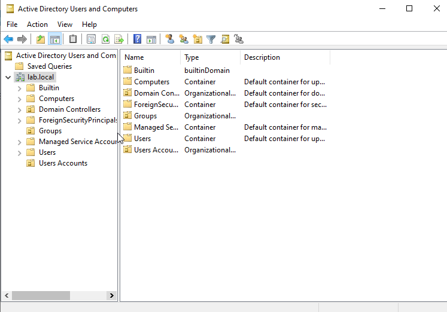

## Step 9: Create Security Groups

Two security groups were created inside the `Groups` OU:

- `HR-Team`
- `IT-Helpdesk`

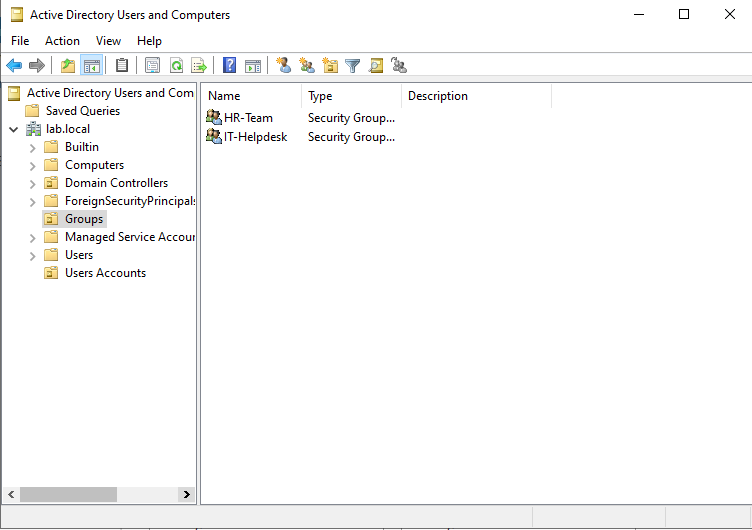

## Step 10: Create User Accounts

Two user accounts were created inside the `Users Account` OU:

| User | Username |
|---|---|
| John Doe | jdoe |
| Alice Smith | asmith |

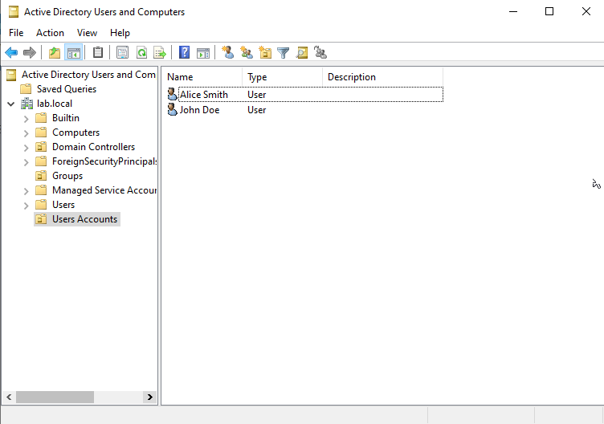

## Step 11: Assign Group Membership

The users were assigned to their appropriate security groups:

| User | Group |
|---|---|
| jdoe | HR-Team |
| asmith | IT-Helpdesk |

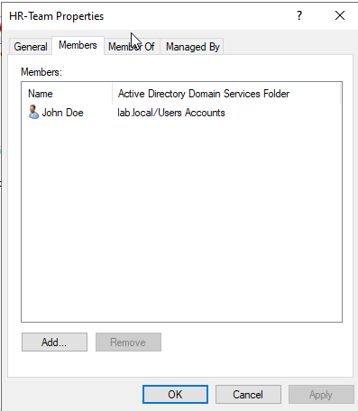

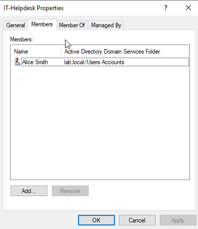

## Step 12: Configure Password Policy

The Default Domain Policy was edited to enforce a basic password policy baseline:

| Policy | Setting |
|---|---|
| Minimum password length | 12 |
| Password must meet complexity requirements | Enabled |

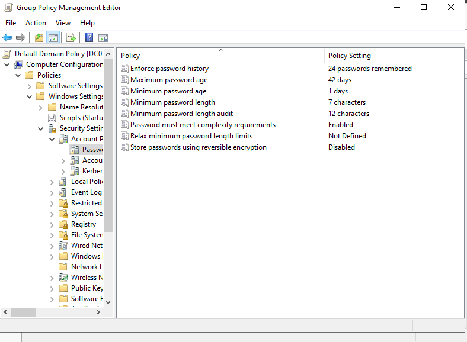

## Step 13: Verify with PowerShell

PowerShell was used to verify that the Active Directory users and group memberships were created correctly.

Example commands used:

```powershell
Import-Module ActiveDirectory
Get-ADUser jdoe -Properties MemberOf
Get-ADUser asmith -Properties MemberOf
Get-ADGroupMember "HR-Team"
Get-ADGroupMember "IT-Helpdesk"
```

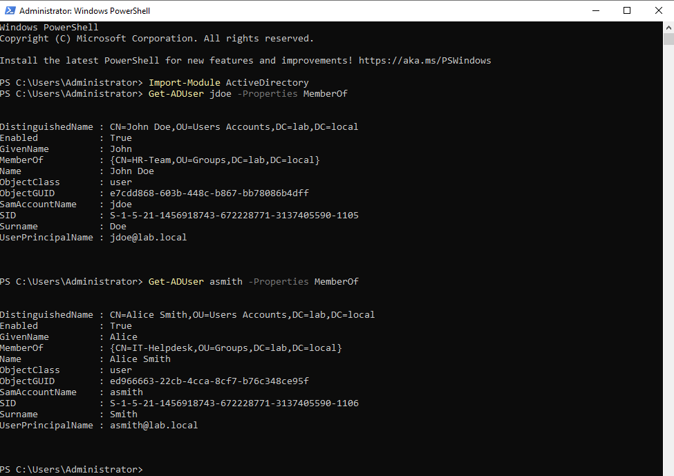

## What I Learned

Through this lab, I practiced the basic workflow of building and managing an Active Directory environment from scratch. I learned how important DNS is to Active Directory, why a Domain Controller should use a static IP address, and how users, groups, Organizational Units, and Group Policy fit together.

This lab also reinforced the importance of verification. Instead of only relying on the graphical interface, I used PowerShell commands to confirm that the users and group memberships were actually present in Active Directory.

## Future Improvements

Possible improvements for this lab include:

- Add a Windows client VM and join it to the `lab.local` domain
- Create more Organizational Units for departments
- Apply Group Policy Objects to specific OUs
- Create shared folders and assign permissions by group
- Add account lockout policies
- Create a basic help desk admin account with delegated permissions
- Document troubleshooting steps for DNS, domain join, and login issues
- Rebuild the lab in Microsoft Azure as a cloud-hosted version

## Security and Ethics Notice

This lab was created for educational purposes in a private local environment. It should not be exposed directly to the public internet. Lab passwords, fake users, and internal IP addresses should not be reused in real environments.

Only test, scan, or administer systems that you own or have explicit permission to manage.
