# Active Directory Home Lab Part 2: Join CLIENT01 to the Domain

## Overview

This project documents Part 2 of a local Active Directory home lab. In Part 1, a Windows Server 2022 Domain Controller named `DC01` was created for the `lab.local` domain. In this part, a Windows 11 client machine named `CLIENT01` is created, configured, pointed to the Domain Controller for DNS, joined to the `lab.local` domain, and verified as a domain-joined computer.

The main goal of this lab is to demonstrate how a Windows client joins an Active Directory domain and authenticates using domain user accounts.

## Lab Objectives

This lab demonstrates how to:

- Create a Windows 11 client VM in VirtualBox
- Attach a Windows 11 ISO
- Configure bridged networking
- Install Windows 11 Pro
- Create a temporary local administrator account
- Configure the client DNS server to point to the Domain Controller
- Verify DNS resolution for `dc01.lab.local`
- Join `CLIENT01` to the `lab.local` domain
- Log in with an Active Directory domain user
- Verify domain login with PowerShell
- Confirm that `CLIENT01` appears in Active Directory Users and Computers

## Lab Environment

| Component | Value |
|---|---|
| Hypervisor | Oracle VirtualBox |
| Domain Controller | DC01 |
| Domain | lab.local |
| Domain Controller IP | 192.168.86.10 |
| Client VM | CLIENT01 |
| Client OS | Windows 11 Pro |
| Client IP | DHCP |
| Client DNS Server | 192.168.86.10 |
| Network Mode | Bridged Adapter |
| Temporary Local Account | localadmin |
| Domain Test User | LAB\jdoe |

> Your IP addresses may be different depending on your home network. The important rule is that `CLIENT01` must use the Domain Controller's IP address as its DNS server.

## Requirements

See [`REQUIREMENTS.md`](REQUIREMENTS.md) for the full hardware, software, and network requirements.

## Project Structure

```text
active-directory-homelab-part2-client-domain-join/
├── README.md
├── REQUIREMENTS.md
├── requirements.txt
└── screenshots/
    ├── 01-client01-vm-created.png
    ├── 02-windows-iso-attached.png
    ├── 03-bridged-network-adapter.png
    ├── 04-windows-11-pro-selected.png
    ├── 05-client01-localadmin-desktop.png
    ├── 06-client01-dns-set-to-dc01.png
    ├── 07-client01-dns-verification.png
    ├── 08-join-lab-local-domain.png
    ├── 09-welcome-to-lab-domain.png
    ├── 10-domain-user-login.png
    ├── 11-whoami-domain-verification.png
    └── 12-client01-in-active-directory.png
```

---

# Step 1: Create the CLIENT01 Virtual Machine

A new VirtualBox virtual machine was created for the Windows client.

Configuration used:

```text
Name: CLIENT01
Type: Microsoft Windows
Version: Windows 11 64-bit
Memory: 4096 MB
Processors: 2
Virtual disk: 50 GB VDI
```

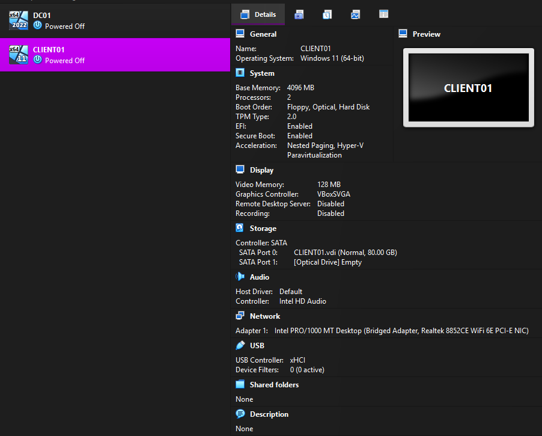

This VM will become the Windows client that joins the `lab.local` Active Directory domain.

---

# Step 2: Attach the Windows 11 ISO

The Windows 11 ISO was attached to the VM through VirtualBox storage settings.

Path:

```text
CLIENT01 → Settings → Storage
```

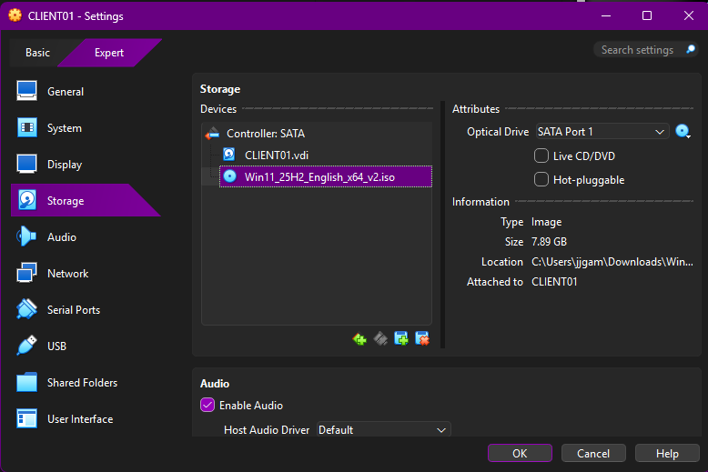

This allows the VM to boot into the Windows installer.

---

# Step 3: Configure Bridged Networking

The network adapter was configured as a **Bridged Adapter**.

Path:

```text
CLIENT01 → Settings → Network
```

Configuration:

```text
Adapter 1: Enabled
Attached to: Bridged Adapter
Name: Same host network adapter used by DC01
```

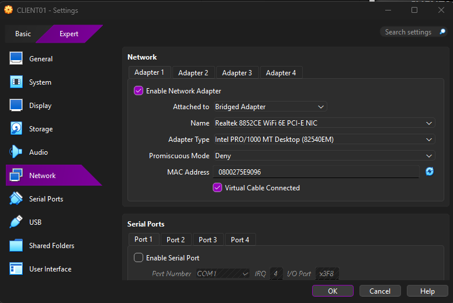

Bridged networking is important because the client and Domain Controller need to communicate on the same local network. If the client is left on NAT, domain joining may fail or require extra routing work.

---

# Step 4: Install Windows 11 Pro

Windows 11 was installed on `CLIENT01`.

During edition selection, **Windows 11 Pro** was selected.

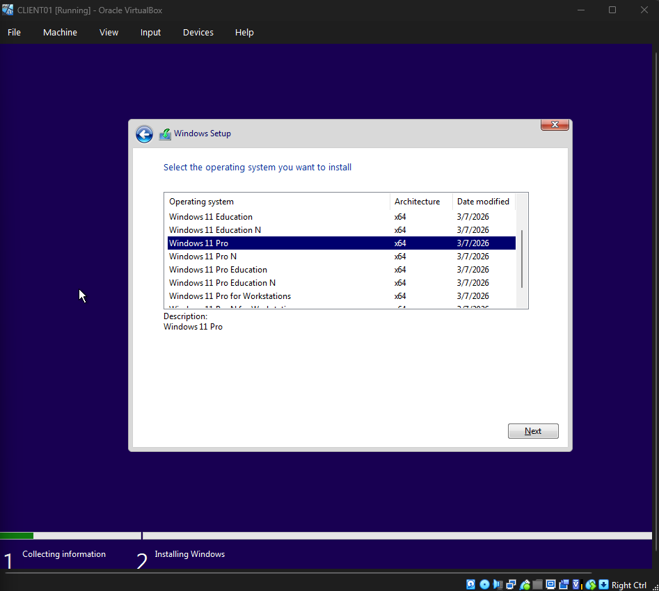

This matters because Windows Home editions cannot join an Active Directory domain. A Pro, Enterprise, or Education edition is required.

---

# Step 5: Finish Windows Setup with a Local Account

Windows setup was completed using a temporary local administrator account instead of a Microsoft account.

Local setup account used:

```text
localadmin
```

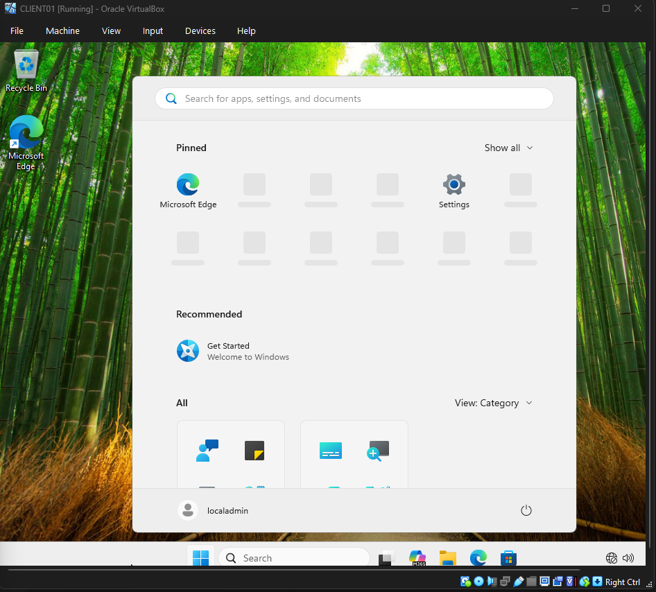

This local account is only used to finish setup and configure the machine. After the domain join, normal testing is done with Active Directory users such as `LAB\jdoe` or `LAB\asmith`.

---

# Step 6: Set CLIENT01 DNS to DC01

On `CLIENT01`, the IPv4 DNS settings were changed so the client uses the Domain Controller for DNS.

Path:

```text
Control Panel
→ Network and Internet
→ Network and Sharing Center
→ Change adapter settings
→ Ethernet Properties
→ Internet Protocol Version 4 (TCP/IPv4)
→ Properties
```

Configuration used:

```text
Obtain an IP address automatically: Enabled
Preferred DNS server: 192.168.86.10
Alternate DNS server: Blank
```

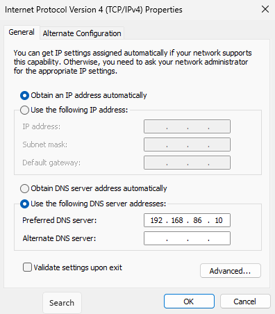

This is one of the most important steps in the lab. Active Directory depends heavily on DNS. The client must use the Domain Controller for DNS so it can locate domain services.

---

# Step 7: Verify DNS Resolution

PowerShell was used to verify the client network and DNS configuration.

Commands used:

```powershell
ipconfig /all
nslookup dc01.lab.local
```

The output confirmed:

```text
CLIENT01 IPv4 Address: 192.168.86.24
Default Gateway: 192.168.86.1
DNS Server: 192.168.86.10
dc01.lab.local resolves to 192.168.86.10
```

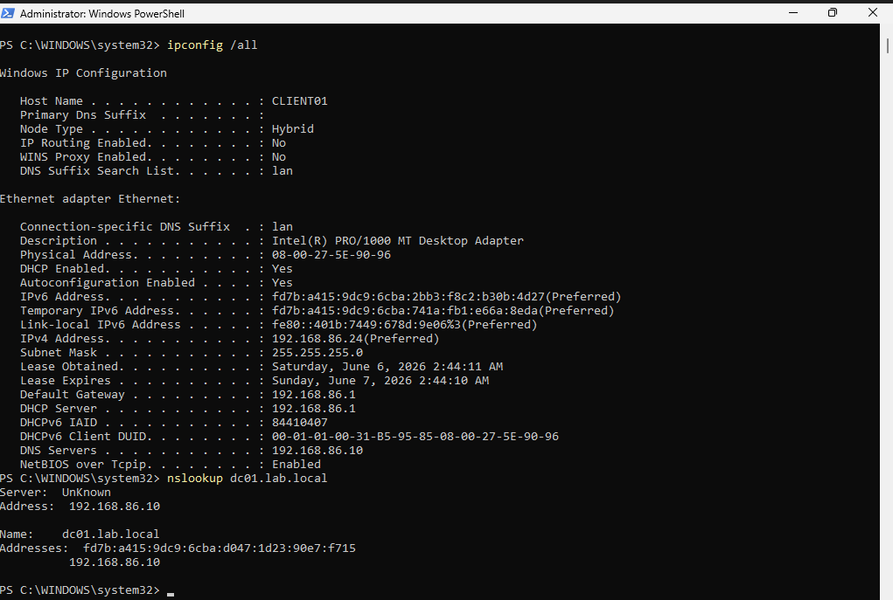

This confirms that `CLIENT01` can resolve the Domain Controller before attempting the domain join.

---

# Step 8: Join CLIENT01 to the lab.local Domain

System Properties was opened using:

```text
sysdm.cpl
```

Then the computer was joined to the domain:

```text
Computer Name tab → Change → Member of: Domain → lab.local
```

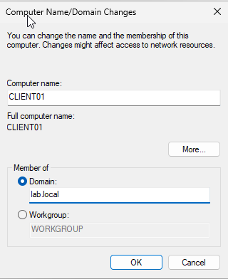

Domain administrator credentials were used when prompted:

```text
Username: LAB\Administrator
Password: Domain Administrator password
```

The password was not documented or screenshotted.

---

# Step 9: Confirm the Domain Join

After entering valid domain administrator credentials, Windows displayed the domain join success message.

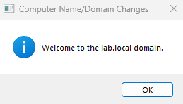

This confirms that `CLIENT01` successfully joined the `lab.local` Active Directory domain.

The machine was then restarted.

---

# Step 10: Log In as a Domain User

After rebooting, the login screen was used to sign in with a domain user created in Part 1.

Example domain login:

```text
LAB\jdoe
```

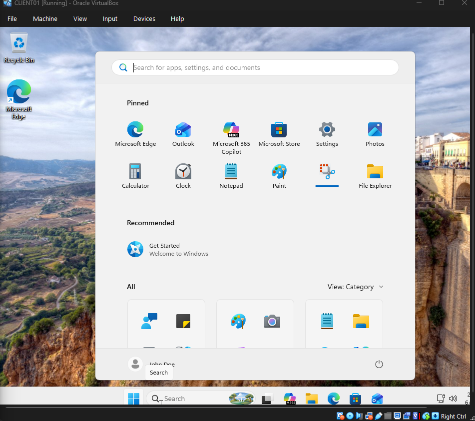

This validates that a real Active Directory user can authenticate on the domain-joined client.

---

# Step 11: Verify Domain Login with PowerShell

After logging in, PowerShell was used to verify the current user context.

Command used:

```powershell
whoami
```

Expected result:

```text
lab\jdoe
```

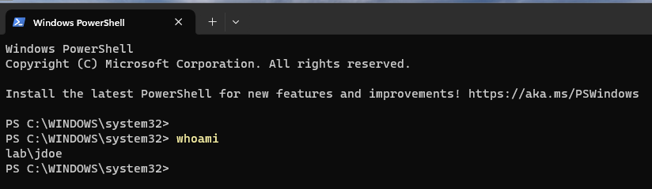

This confirms that the session is running as a domain user, not as the local `localadmin` account.

---

# Step 12: Verify CLIENT01 in Active Directory

On `DC01`, Active Directory Users and Computers was opened.

Path:

```text
Server Manager
→ Tools
→ Active Directory Users and Computers
→ lab.local
→ Computers
```

The `CLIENT01` computer object appeared in the Computers container.

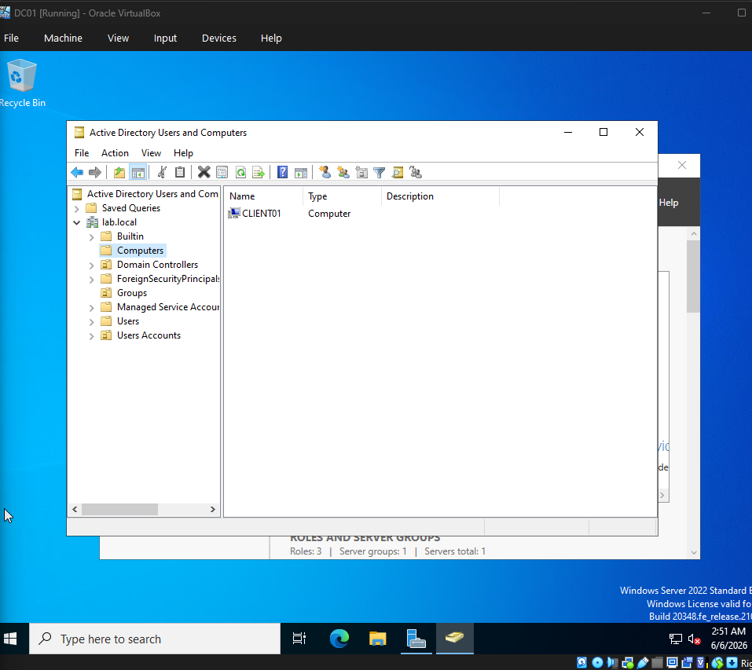

This confirms that the Domain Controller recognizes `CLIENT01` as a domain-joined computer.

---

## What I Learned

This lab helped reinforce how Windows clients locate and join an Active Directory domain. The biggest lesson was that DNS must be configured correctly before attempting the domain join. Even if the client has internet access, the domain join can fail if the client is using the router or a public DNS server instead of the Domain Controller.

I also practiced the difference between a local Windows account and a domain account. The local account was used only for initial setup, while the domain account was used after `CLIENT01` joined `lab.local`.

## Troubleshooting Notes

Common problems and fixes:

| Problem | Likely Cause | Fix |
|---|---|---|
| Cannot join domain | CLIENT01 DNS points to router/public DNS | Set preferred DNS to DC01 IP |
| `nslookup dc01.lab.local` fails | DC01 DNS not reachable or not running | Confirm DC01 is powered on and DNS service is running |
| Windows setup forces Microsoft account | Internet connection active during setup | Disconnect VM network and use offline/local setup |
| Domain option missing | Windows Home edition installed | Install Windows Pro, Enterprise, or Education |
| CLIENT01 cannot reach DC01 | Wrong network mode | Use Bridged Adapter on both VMs |
| Login fails after domain join | Wrong username format | Use `LAB\username` |

## Future Improvements

Possible next steps:

- Move `CLIENT01` into a custom Workstations OU
- Create a Group Policy Object for domain-joined clients
- Apply a desktop wallpaper or security setting with GPO
- Create shared folders on DC01 and assign access by security group
- Test login restrictions and account lockout policy
- Add another client VM
- Rebuild the same lab in Microsoft Azure
- Add screenshots of Group Policy applying with `gpupdate /force` and `gpresult /r`

## Security and Ethics Notice

This lab was created for educational purposes in a private local environment. Do not expose the Domain Controller or client VM directly to the public internet. Do not use real personal passwords, production credentials, or sensitive data in lab environments.

Only administer systems that you own or have explicit permission to manage.
