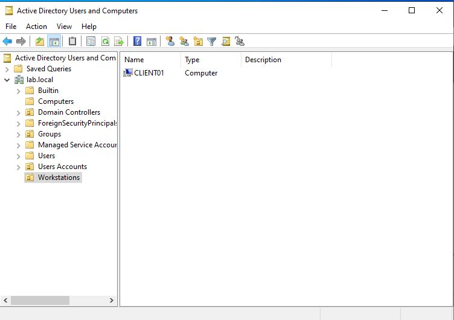
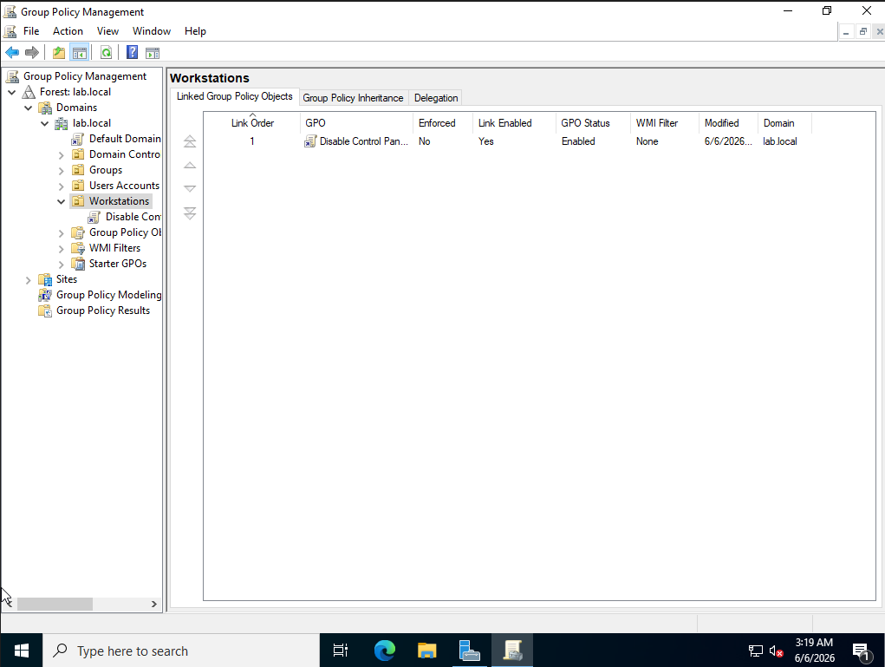
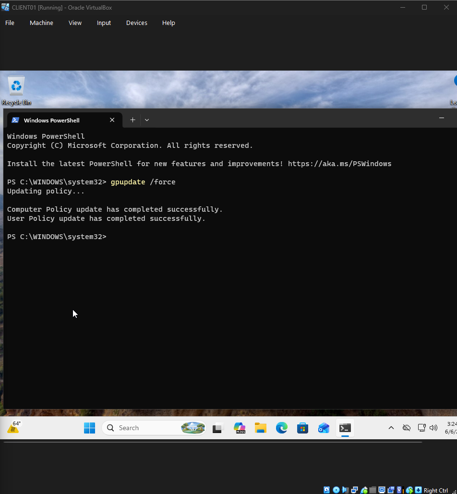
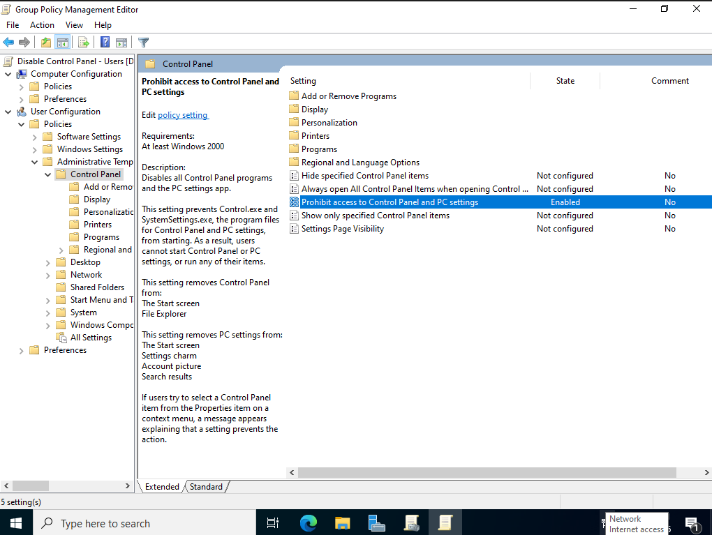

# Group Policy Management Lab

## Overview

This lab documents how to create, link, apply, and verify a Group Policy Object in a local Active Directory environment.

The goal of this lab was to use Group Policy to block access to Control Panel and PC Settings for a domain user on a domain-joined Windows client.

This lab builds on the previous Active Directory labs:

- `01-domain-controller-setup`
- `02-client-domain-join`

In this lab, the Domain Controller `DC01` manages policy for the `lab.local` domain, and the domain-joined client `CLIENT01` is used to verify that the policy applies successfully.

## Lab Objective

The objective of this lab was to prove that a Group Policy Object can be:

- Created in Group Policy Management
- Linked to an Organizational Unit
- Configured through Group Policy Management Editor
- Pulled by a domain-joined client using `gpupdate /force`
- Verified with `gpresult /r`
- Tested by attempting to open Control Panel

## Lab Environment

| Component | Value |
|---|---|
| Hypervisor | Oracle VirtualBox |
| Domain Controller | DC01 |
| Domain | lab.local |
| Client Machine | CLIENT01 |
| Test User | LAB\jdoe |
| Target Computer OU | Workstations |
| Policy Type | User Configuration |
| Policy Purpose | Block Control Panel and PC Settings |
| GPO Name | Disable Control Panel |

## Requirements

See [`REQUIREMENTS.md`](REQUIREMENTS.md) for the full requirements.

## Project Structure

```text
03-group-policy-management/
├── README.md
├── REQUIREMENTS.md
├── requirements.txt
└── screenshots/
    ├── 01-client01-in-workstations-ou.png
    ├── 02-gpo-linked-to-workstations-ou.png
    ├── 03-control-panel-policy-enabled.png
    ├── 04-gpupdate-force-success.png
    ├── 05-gpresult-applied-gpo.png
    └── 06-control-panel-blocked.png
```

## Important Note

This lab uses a Control Panel restriction under **User Configuration**.

The screenshots show the policy being applied successfully to the domain user `LAB\jdoe`. The final verification is done with `gpresult /r`, which confirms the GPO appears under **Applied Group Policy Objects** for the user.

If this policy does not apply in another environment, the usual causes are:

- The GPO is linked to the wrong OU
- The user is not in the OU targeted by the policy
- Security filtering is blocking the user
- Group Policy has not refreshed yet
- The setting was not actually enabled in the GPO

## Step 1: Confirm CLIENT01 Is in the Workstations OU

On `DC01`, open:

```text
Server Manager → Tools → Active Directory Users and Computers
```

Then expand:

```text
lab.local → Workstations
```

The domain-joined client `CLIENT01` should appear inside the `Workstations` OU.



This confirms that the client computer is organized into a dedicated workstation OU instead of being left in the default `Computers` container.

## Step 2: Confirm the GPO Is Linked

On `DC01`, open:

```text
Server Manager → Tools → Group Policy Management
```

Then expand:

```text
Forest: lab.local
→ Domains
→ lab.local
→ Workstations
```

The GPO should be linked under the `Workstations` OU.



This confirms the GPO is linked and enabled.

## Step 3: Enable the Control Panel Restriction

Right-click the GPO and select:

```text
Edit
```

Navigate to:

```text
User Configuration
→ Policies
→ Administrative Templates
→ Control Panel
```

Enable this policy:

```text
Prohibit access to Control Panel and PC settings
```


This setting prevents users from opening Control Panel and PC Settings.

## Step 4: Force Group Policy Update on CLIENT01

On `CLIENT01`, log in as the domain user:

```text
LAB\jdoe
```

Open PowerShell and run:

```powershell
gpupdate /force
```

The update should complete successfully for both computer policy and user policy.



This confirms that `CLIENT01` contacted the domain and refreshed Group Policy.

## Step 5: Verify the GPO Applied

Still on `CLIENT01`, run:

```powershell
gpresult /r
```

Under **User Settings**, look for:

```text
Applied Group Policy Objects
```

The applied GPO should appear in the output.


This is the strongest proof screenshot because it confirms the policy was actually applied to the domain user.

## Step 6: Test Control Panel Access

On `CLIENT01`, attempt to open Control Panel.

Windows should display a restriction message stating that the operation was cancelled due to restrictions in effect on the computer.



This confirms the policy had the intended effect.

## What I Learned

Through this lab, I learned how Group Policy can be used to centrally enforce settings in an Active Directory domain. I also learned that creating a GPO is not enough by itself. The policy must be linked correctly, refreshed on the client, and verified with tools like `gpupdate /force` and `gpresult /r`.

This lab also reinforced that screenshots should prove the important parts of the workflow:

1. The target object exists in Active Directory
2. The GPO is linked
3. The setting is enabled
4. The client updates policy successfully
5. The GPO appears in `gpresult`
6. The policy works when tested

## Troubleshooting Notes

| Problem | Likely Cause | Fix |
|---|---|---|
| GPO does not show in `gpresult /r` | GPO linked to wrong OU | Confirm the user/computer target is in the correct OU |
| `Applied Group Policy Objects` shows `N/A` | Policy did not apply | Check OU link, security filtering, and DNS |
| Control Panel still opens | Policy has not refreshed | Run `gpupdate /force`, sign out, and sign back in |
| Policy appears empty | Setting was not enabled | Reopen the GPO and confirm the policy is Enabled |
| Client cannot receive policy | DNS or domain connectivity issue | Confirm CLIENT01 uses DC01 as DNS |

## Future Improvements

Possible improvements for this lab include:

- Create a dedicated `Lab Users` OU
- Create a dedicated `Workstations` OU
- Test loopback processing for workstation-targeted user policies
- Create a mapped network drive GPO
- Create a desktop wallpaper GPO
- Create an account lockout policy lab
- Generate an HTML policy report with `gpresult /h report.html`

## Security and Ethics Notice

This lab was created for educational use in a private local Active Directory environment. Do not test administrative policies on systems you do not own or manage. Avoid using real passwords, production credentials, or sensitive personal information in lab environments.
