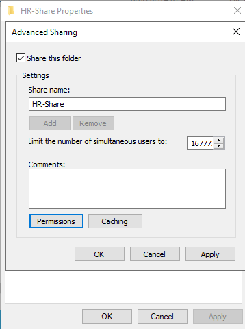
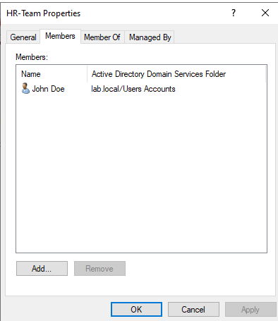
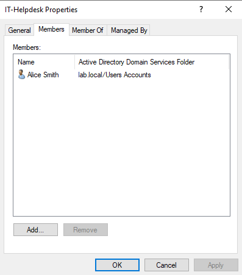
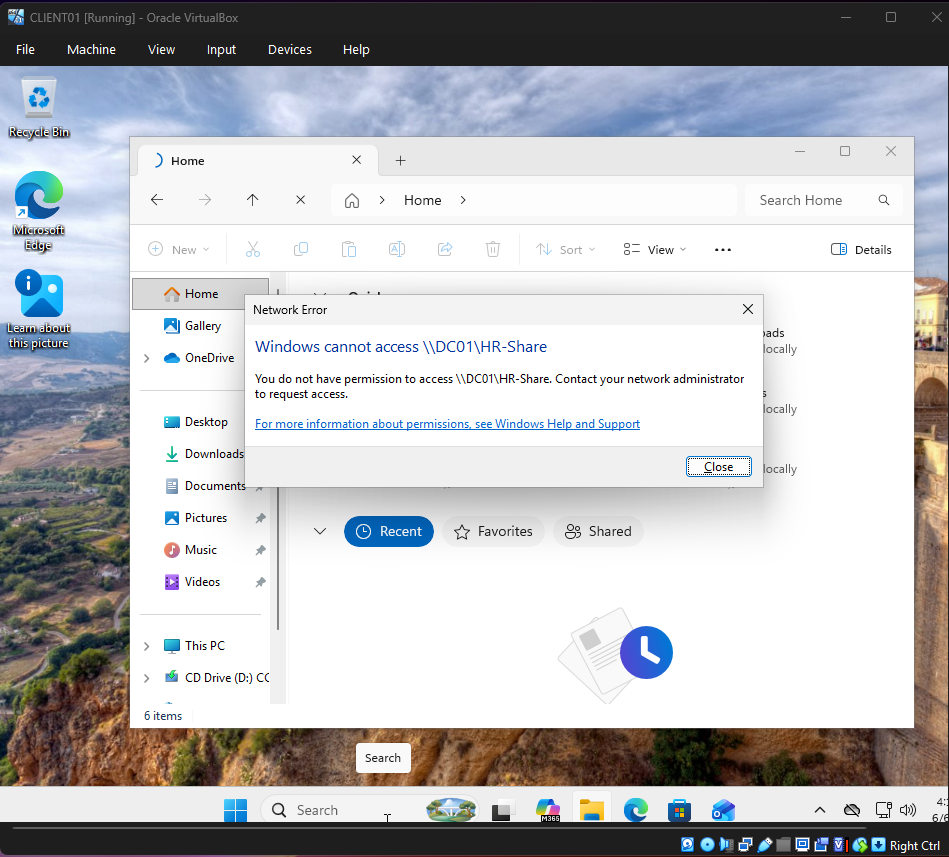
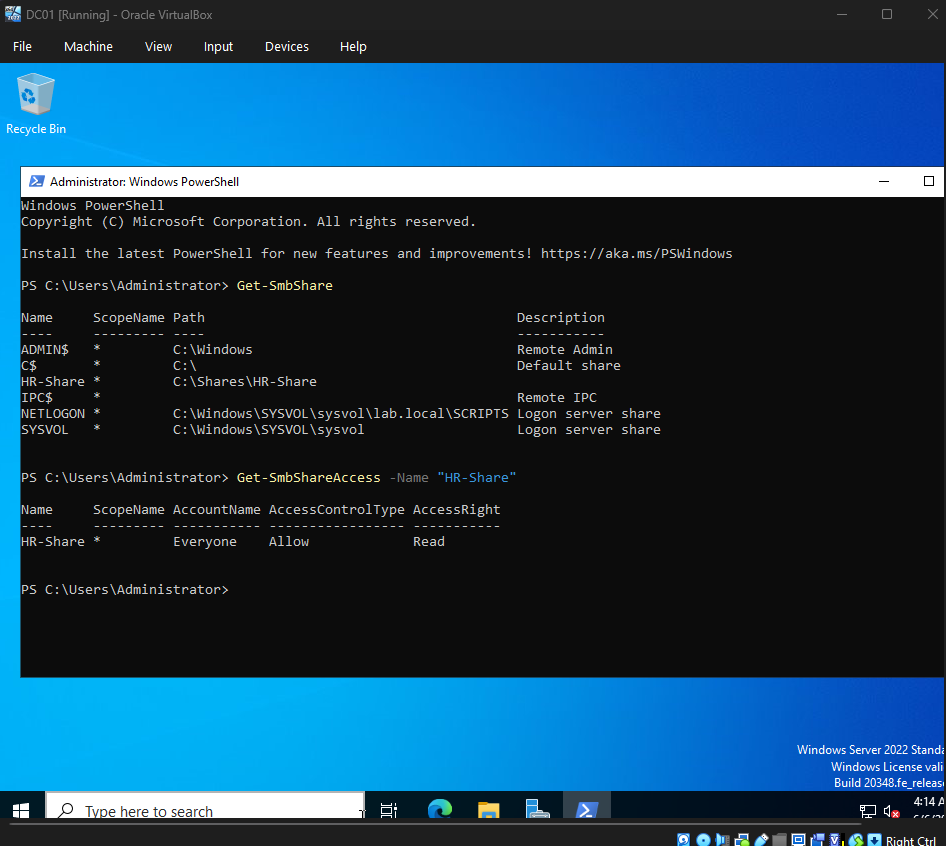

# File Share Permissions Lab

## Overview

This lab documents how to configure and test file share permissions in a local Active Directory environment.

The goal of this lab was to create a shared folder on the Domain Controller, assign access through an Active Directory security group, and verify that authorized users can access the share while unauthorized users cannot.

This lab builds on the previous Active Directory labs:

- `01-domain-controller-setup`
- `02-client-domain-join`
- `03-group-policy-management`

The main concept demonstrated in this lab is:

```text
Users → Groups → Permissions → Access
```

Instead of assigning permissions directly to individual users, access is assigned to a security group. User access is then controlled by group membership.

## Lab Objective

This lab demonstrates how to:

- Create a shared folder on `DC01`
- Configure SMB sharing
- Configure NTFS permissions
- Assign folder access to an Active Directory security group
- Confirm user group membership
- Test successful access as an authorized user
- Test denied access as an unauthorized user
- Verify share and file permissions with PowerShell

## Lab Environment

| Component | Value |
|---|---|
| Hypervisor | Oracle VirtualBox |
| Domain Controller | DC01 |
| Domain | lab.local |
| Client Machine | CLIENT01 |
| Shared Folder | C:\Shares\HR-Share |
| Network Path | \\DC01\HR-Share |
| Authorized Group | HR-Team |
| Authorized User | LAB\jdoe |
| Unauthorized User | LAB\asmith |

## Requirements

See [`REQUIREMENTS.md`](REQUIREMENTS.md) for the full requirements.

## Project Structure

```text
04-file-share-permissions/
├── README.md
├── REQUIREMENTS.md
├── requirements.txt
└── screenshots/
    ├── 01-hr-share-folder-created.png
    ├── 02-hr-share-sharing-enabled.png
    ├── 03-hr-team-ntfs-permissions.png
    ├── 04-jdoe-in-hr-team.png
    ├── 05-asmith-not-in-hr-team.png
    ├── 06-jdoe-access-success.png
    ├── 07-asmith-access-denied.png
    └── 08-powershell-share-verification.png
```

## Important Concept: Share Permissions vs NTFS Permissions

Windows file sharing uses two permission layers:

| Permission Type | Purpose |
|---|---|
| Share permissions | Control access over the network |
| NTFS permissions | Control access to the folder on the file system |

When both apply, Windows uses the most restrictive effective permission.

For this lab, access is controlled through the `HR-Team` security group. This is better than assigning permissions directly to `jdoe` because group-based access is easier to manage and closer to how permissions are handled in real environments.

## Step 1: Create the HR-Share Folder

On `DC01`, a folder was created at:

```text
C:\Shares\HR-Share
```

A test file was added inside the folder to confirm access later from `CLIENT01`.



This folder will be shared over the network as:

```text
\\DC01\HR-Share
```

## Step 2: Enable Sharing

The folder was shared using the Advanced Sharing settings.

Configuration:

```text
Share this folder: Enabled
Share name: HR-Share
```


This makes the folder reachable from domain-joined clients using the UNC path:

```text
\\DC01\HR-Share
```

## Step 3: Configure NTFS Permissions for HR-Team

The NTFS permissions were configured so access is controlled through the `HR-Team` Active Directory security group.

The correct permission model is:

```text
SYSTEM          Full control
Administrators  Full control
HR-Team         Read/Modify access depending on lab goal
```

Broad access such as `Domain Users` or `LAB\Users` should not be left with access if the goal is to prove HR-only permissions.



This is the core security configuration of the lab. The folder should be accessible because of group membership, not because every domain user has access.

## Step 4: Confirm jdoe Is in HR-Team

In Active Directory Users and Computers, `jdoe` was confirmed as a member of the `HR-Team` group.


This means `jdoe` should be able to access the HR share.

## Step 5: Confirm asmith Is Not in HR-Team

The unauthorized test user `asmith` was not added to `HR-Team`.



This matters because the access test is only meaningful if `asmith` is outside the authorized group.

## Step 6: Test Access as jdoe

On `CLIENT01`, the user `LAB\jdoe` was used to access the share:

```text
\\DC01\HR-Share
```

Because `jdoe` is a member of `HR-Team`, access should succeed.



This confirms that group-based access works for the authorized user.

## Step 7: Test Access as asmith

On `CLIENT01`, the user `LAB\asmith` was used to test the same share:

```text
\\DC01\HR-Share
```

Because `asmith` is not a member of `HR-Team`, access should be denied.


This is one of the strongest screenshots in the lab because it proves the permissions are actually being enforced.

## Step 8: Verify with PowerShell

On `DC01`, PowerShell was used to verify the SMB share and folder permissions.

Useful commands:

```powershell
Get-SmbShare
Get-SmbShareAccess -Name "HR-Share"
icacls "C:\Shares\HR-Share"
```



PowerShell verification is useful because it confirms the share exists and shows permission information without relying only on the graphical interface.

## What I Learned

Through this lab, I learned how shared folder access works in a Windows domain environment. The most important lesson was that permissions should be assigned to groups, not directly to users.

This lab also reinforced the difference between share permissions and NTFS permissions. Share permissions control network access, while NTFS permissions control file system access. When both exist, the most restrictive permission wins.

## Troubleshooting Notes

| Problem | Likely Cause | Fix |
|---|---|---|
| `jdoe` cannot access the share | `jdoe` is not in `HR-Team` | Add `jdoe` to `HR-Team` and sign out/sign back in |
| `asmith` can access the share | Broad group like `Domain Users` still has access | Remove broad user groups from NTFS permissions |
| Share path does not open | DNS or network issue | Test `ping DC01` and confirm CLIENT01 uses DC01 as DNS |
| Access changes do not apply | User token has not refreshed | Sign out and sign back in |
| PowerShell does not show the share | Folder was not shared correctly | Recheck Advanced Sharing settings |

## Future Improvements

Possible improvements for this lab include:

- Create separate shares for HR and IT
- Give `HR-Team` Modify access and test file creation
- Give `IT-Helpdesk` read-only access to a different share
- Map the share automatically using Group Policy
- Create a hidden administrative-style share such as `HR-Share$`
- Audit file access events with Windows Event Viewer
- Document effective access using the Effective Access tab

## Security and Ethics Notice

This lab was created for educational use in a private local Active Directory environment. Do not test permissions or access controls on systems you do not own or manage. Do not use real personal data, real production credentials, or sensitive files in lab environments.
