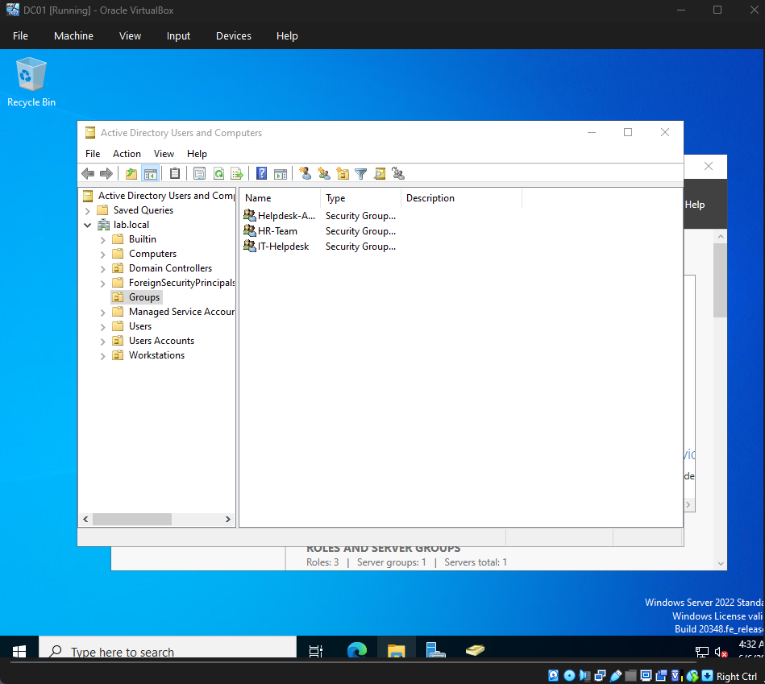
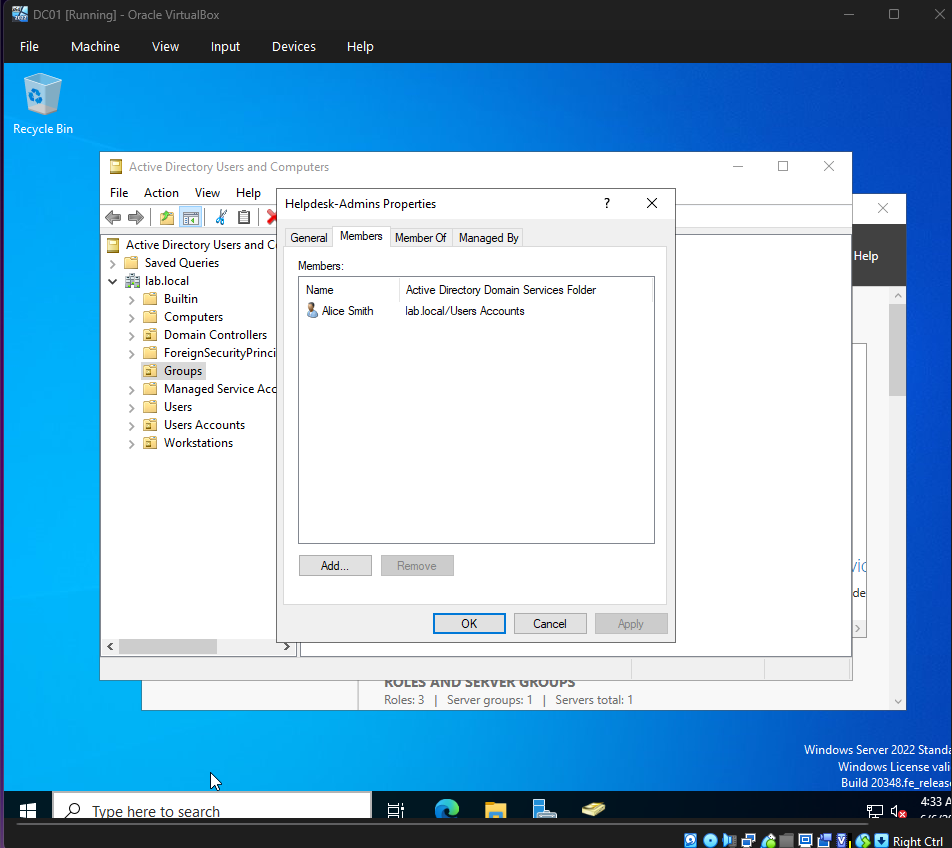
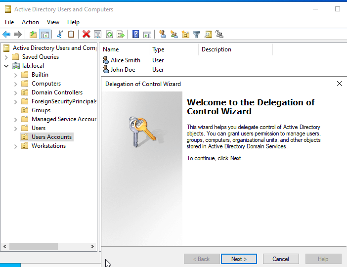
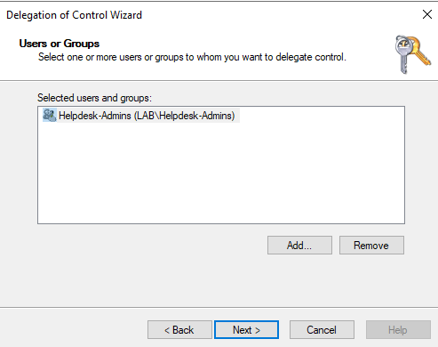
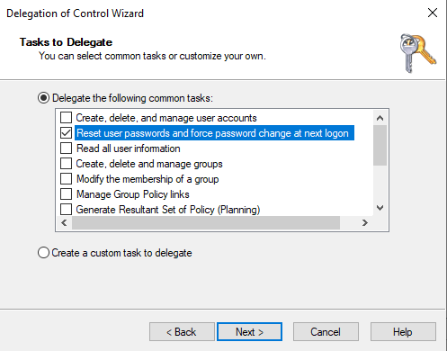
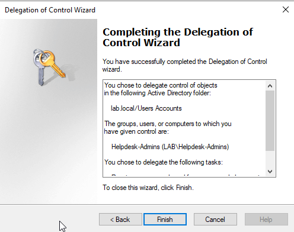
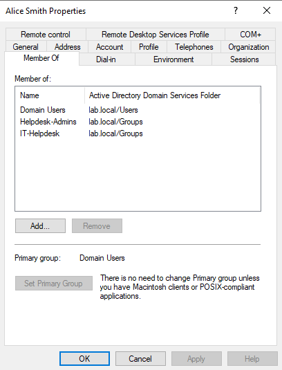
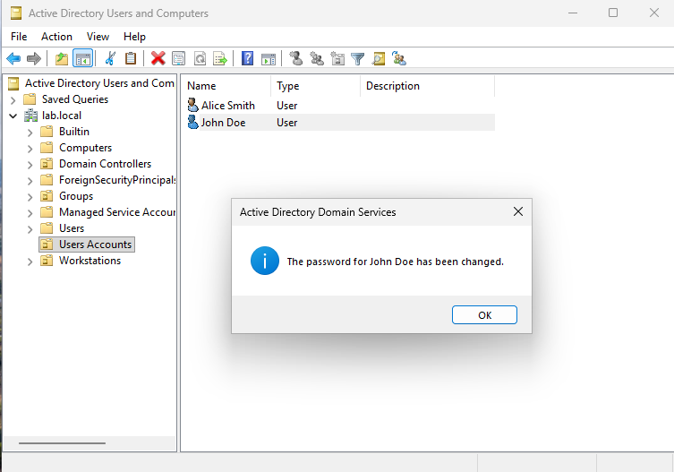
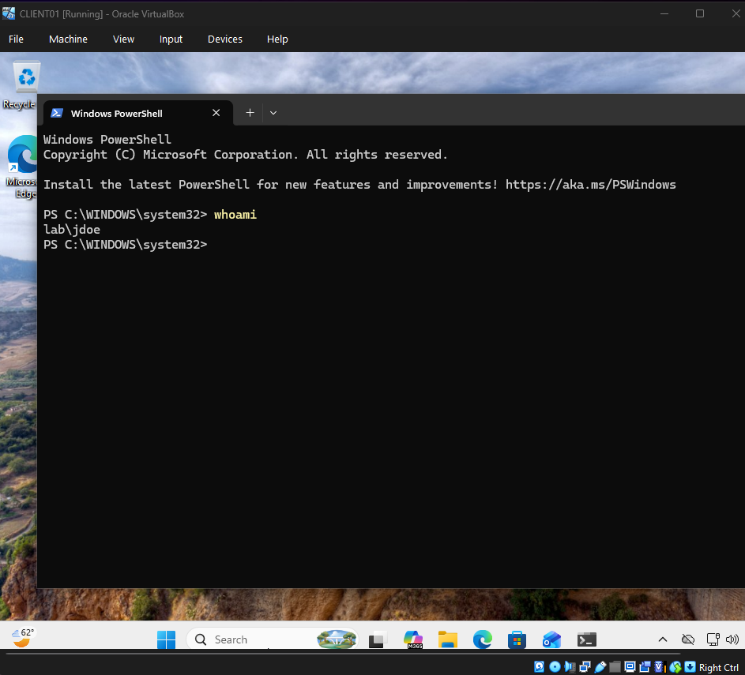
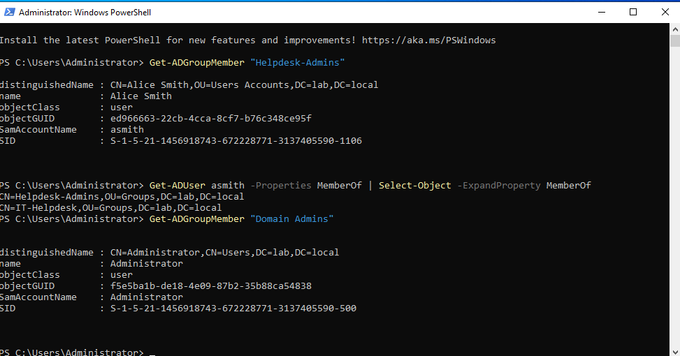

# Delegated Administration Lab

## Overview

This lab documents how to configure delegated administration in a local Active Directory environment.

The goal of this lab was to allow a help desk user to reset passwords for users in a specific Organizational Unit without making that user a Domain Admin.

This lab builds on the previous Active Directory labs:

- `01-domain-controller-setup`
- `02-client-domain-join`
- `03-group-policy-management`
- `04-file-share-permissions`

The main concept demonstrated in this lab is **least privilege**.

Instead of giving a help desk user full administrative control over the domain, a specific administrative task is delegated to a security group.

## Lab Objective

This lab demonstrates how to:

- Create a `Helpdesk-Admins` security group
- Add `asmith` to the delegated help desk group
- Delegate password reset permissions over the `Users Accounts` OU
- Confirm `asmith` is not a Domain Admin
- Reset `jdoe`'s password using the delegated help desk account
- Verify `jdoe` can log in with the reset password
- Verify delegation and group membership with PowerShell

## Lab Environment

| Component | Value |
|---|---|
| Hypervisor | Oracle VirtualBox |
| Domain Controller | DC01 |
| Domain | lab.local |
| Client Machine | CLIENT01 |
| Delegated Group | Helpdesk-Admins |
| Delegated User | LAB\asmith |
| Target User | LAB\jdoe |
| Target OU | Users Accounts |
| Delegated Task | Reset user passwords and force password change at next logon |

## Requirements

See [`REQUIREMENTS.md`](REQUIREMENTS.md) for the full requirements.

## Project Structure

```text
05-delegated-administration/
├── README.md
├── REQUIREMENTS.md
├── requirements.txt
└── screenshots/
    ├── 01-helpdesk-admins-group-created.png
    ├── 02-asmith-added-to-helpdesk-admins.png
    ├── 03-delegation-wizard-start.png
    ├── 04-helpdesk-admins-selected-for-delegation.png
    ├── 05-reset-password-task-selected.png
    ├── 06-delegation-wizard-completed.png
    ├── 07-asmith-not-domain-admin.png
    ├── 08-asmith-reset-jdoe-password-success.png
    ├── 09-jdoe-login-verified-whoami.png
    └── 10-powershell-delegation-verification.png
```

## Important Concept: Delegation and Least Privilege

Delegated administration allows specific administrative tasks to be assigned without giving full domain administrator rights.

In this lab:

```text
asmith → member of Helpdesk-Admins
Helpdesk-Admins → delegated password reset permission over Users Accounts OU
asmith → not a Domain Admin
```

This follows the principle of least privilege because `asmith` receives only the access needed to perform a help desk task.

## Step 1: Create the Helpdesk-Admins Group

On `DC01`, Active Directory Users and Computers was used to create a new security group inside the `Groups` OU.

Group settings:

```text
Group name: Helpdesk-Admins
Group scope: Global
Group type: Security
```



This group is used to hold users who should receive delegated help desk permissions.

## Step 2: Add asmith to Helpdesk-Admins

The user `asmith` was added to the `Helpdesk-Admins` group.

Path:

```text
Active Directory Users and Computers
→ Groups
→ Helpdesk-Admins
→ Properties
→ Members
```



This means `asmith` will receive any permissions delegated to the `Helpdesk-Admins` group.

## Step 3: Start the Delegation of Control Wizard

The Delegation of Control Wizard was started on the `Users Accounts` OU.

Path:

```text
Active Directory Users and Computers
→ lab.local
→ Users Accounts
→ Delegate Control
```



Delegating at the OU level is important because it scopes the permission to users inside that OU instead of granting broad control over the entire domain.

## Step 4: Select Helpdesk-Admins for Delegation

In the Delegation of Control Wizard, the `Helpdesk-Admins` group was selected.



Delegating permissions to a group is cleaner than delegating permissions directly to a single user. If another help desk user needs the same permission later, they can be added to the group.

## Step 5: Delegate Password Reset Permissions

The following common task was selected:

```text
Reset user passwords and force password change at next logon
```



This gives the `Helpdesk-Admins` group permission to reset user passwords for accounts in the selected OU.

## Step 6: Complete the Delegation Wizard

The Delegation of Control Wizard was completed.



At this point, members of `Helpdesk-Admins` should have the delegated password reset permission over the `Users Accounts` OU.

## Step 7: Confirm asmith Is Not a Domain Admin

The user `asmith` was checked to confirm that she is a member of:

```text
Domain Users
Helpdesk-Admins
IT-Helpdesk
```

She is not a member of:

```text
Domain Admins
```



This is one of the most important proof screenshots in the lab. If `asmith` were a Domain Admin, the password reset test would not prove delegation. It would only prove broad administrative access.

## Step 8: Reset jdoe's Password as asmith

While logged in with the delegated account, `asmith` reset the password for `jdoe` in Active Directory Users and Computers.

Path:

```text
Active Directory Users and Computers
→ lab.local
→ Users Accounts
→ John Doe
→ Reset Password
```

Windows displayed a success message confirming the password was changed.



No real passwords were documented or screenshotted.

## Step 9: Verify jdoe Can Log In

After the password reset, `jdoe` logged in successfully.

PowerShell was used to verify the current user context:

```powershell
whoami
```

Expected output:

```text
lab\jdoe
```



This confirms that the password reset worked.

## Step 10: Verify with PowerShell

PowerShell was used on `DC01` to verify group membership and confirm that `asmith` was not a Domain Admin.

Useful commands:

```powershell
Get-ADGroupMember "Helpdesk-Admins"
Get-ADUser asmith -Properties MemberOf | Select-Object -ExpandProperty MemberOf
Get-ADGroupMember "Domain Admins"
```



This gives command-line proof that the delegation setup is group-based and that `asmith` was not granted full domain administrator rights.

## What I Learned

Through this lab, I learned how delegated administration works in Active Directory. I practiced assigning a limited administrative task to a security group instead of giving a user broad domain administrator privileges.

The main lesson was that administrative access should be scoped. A help desk user may need to reset passwords, but that does not mean they need full control over the domain.

This lab also reinforced the value of group-based permission management:

```text
Users → Groups → Delegated Permissions
```

That model is easier to manage, easier to audit, and safer than assigning permissions directly to individual users.

## Troubleshooting Notes

| Problem | Likely Cause | Fix |
|---|---|---|
| `asmith` cannot reset the password | Delegation was applied to the wrong OU | Delegate control on the OU containing the target user |
| `asmith` still cannot reset after delegation | User token has not refreshed | Sign out and sign back in as `asmith` |
| Password reset works but lab proof is weak | `asmith` is a Domain Admin | Remove `asmith` from privileged admin groups |
| Active Directory Users and Computers is missing on CLIENT01 | RSAT is not installed | Install RSAT Active Directory tools |
| Cannot contact domain | DNS issue | Confirm CLIENT01 uses DC01 as DNS |
| Target user not visible | Looking in the wrong OU | Check the `Users Accounts` OU |

## Future Improvements

Possible improvements for this lab include:

- Delegate account unlock permissions
- Delegate user creation permissions
- Delegate password reset only to a specific department OU
- Create a separate `HR Users` OU and delegate HR-only password resets
- Use PowerShell to test delegated permissions
- Audit password reset events in Event Viewer
- Compare delegated permissions against Domain Admin permissions
- Document the permissions using the Security tab and Advanced permissions

## Security and Ethics Notice

This lab was created for educational use in a private local Active Directory environment. Do not test delegated administration on systems you do not own or manage. Do not use real passwords, real production credentials, or sensitive personal information in lab environments.
